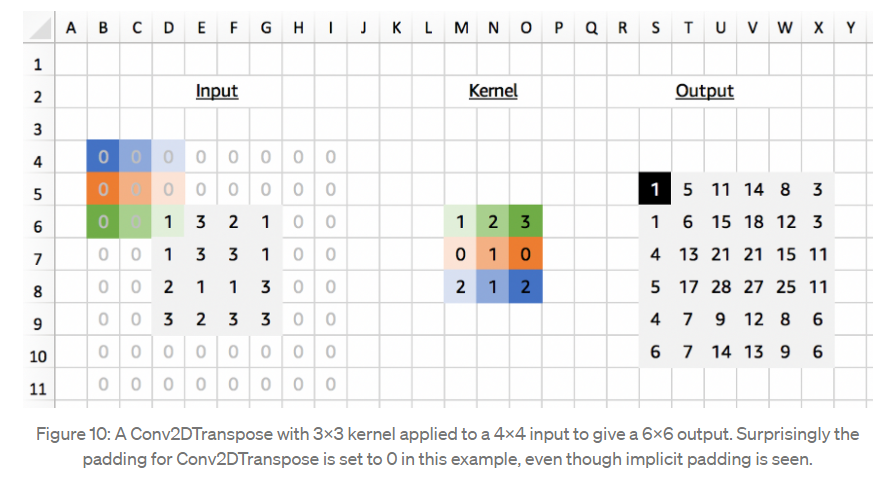

# Semantic_Segmentation
Image segmentation refers to dividing an image into several disjoint regions based on features such as grayscale, color, spatial texture, geometric shape, etc., so that these features show consistency or similarity within the same region, while showing significant differences between different regions [像素点分类]


### Up-sampling/ Transpose convolution based segmentation method
a. FCN(Fully Convolutional Network)
- FCN [parameters: 134,473,084]
<p align="center">
      
      
- Upsampling
1. Nearest Neighbor
2. Bilinear Interpolation
3. Bicubic Interpolation
4. Transpose Convolution

    4.1 stride 1
    
<p align="center">
  
  
   4.2 stride 2
    
<p align="center">
  

```
    python3 models/tensorflow/Upsampling/transpose_conv.py
```
    
[Transpose conv 很难训练， deeplab 依旧使用双线性插值]

  
    
- Advantages

 1. FCN classifies images at the pixel level, thus solving the semantic level image segmentation problem
 2. The FCN can accept input images of any size, it can maintain the spatial information in the original input image

- Disadvantages:

 1. The up-sampled feature maps are blurred and smooth due to upsampling 
 2. It is insensitive to the details in the image
 3. Separate classification of individual pixels, without adequate consideration of pixel-to-pixel relationships, lacking spatial consistency

b. Segnet
<p align="center">
      

SegNet is a deep network proposed by Cambridge aimed at solving image semantic segmentation for autonomous driving or intelligent robots. 
SegNet is based on FCN and is very similar to the idea of FCN, except that its encoder-decoder is slightly different from that of FCN, using depooling in its decoder to upsample the feature map and maintaining the integrity of high-frequency details in the sub-sample; while the encoder does not use a fully connected layer. Therefore, it is a lightweight network with fewer parameters.
[去池化上采样, 少参数, 边界, 重叠处理不好]

- Advantages；
1. Preservation of the integrity of the High Frequent component.
2. Non-bulky networks with fewer parameters, which are more lightweight.

- Disadvantages:
1. Lower confidence in the location of the boundaries for classification.
2. For indistinguishable categories, such as people and bicycles, uncertainty increases if there is mutual overlap between the two.

c. U-net
<p align="center">
      

Standard Unet
```
python3 models/tensorflow/Unet/unet.py
```
      
U-net family: 

1.  Unet ++  [link](https://zhuanlan.zhihu.com/p/44958351)
2.  Attention Unet
3.  Unet 3+
      
- Advantages；
1. Symmetry, good integration of upper and lower level feature maps
2. Feature maps concatenation/ More channels

- Disadvantages:
1. Edge cropping before Feature Map merging [Upsampling bilinear]
2. Valid padding increases the difficulty and universality of model design, many algorithms currently use same padding directly

Questions：

 - The feature extractor is important:
    
    1.1 Good feature representation \
    1.2 Fast convergence speed
  
 - The drawback of feature extractors:
    
    2.1 Overfitting on easy tasks
  
 - The down-sampling is important:
    
    1.1 Robust against small input variance [增加对输入图像的一些小扰动的鲁棒性]\
    1.2 Reduce overfitting [减少过拟合的风险] \
    1.3 Reduce computation cost [降低运算量] \
    1.4 Enlarge receptive field areas [增加感受野的大小]
  
 - The drawback of down-sampling operation
    
    1.1  Compress information, invisibility of small objects 

 - The up-sampling is important:
    
    1.1 Recovers lost resolution in down-sampling \
    1.2 Guides encoder to select important information
 
 - The drawback of up-sampling operation:
    
    1.1 Fails to recover large object boundary accurately
   
 - The skip connection is important:
    
    1.1 Fights the vanishing gradient problem \
    1.2 Learns pyramid level features \
    1.3 Recover info loss in down-sampling 
    
    Notice: 
        
        1. FCN used summation
        2. U-Net used concatenation
        3. SegNet used pooling indice instead of skip connection
        4. Some generators in GAN have NO skip connection

d. PSPNet

